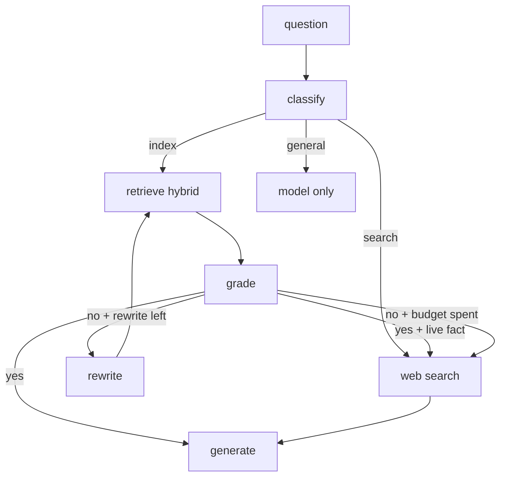
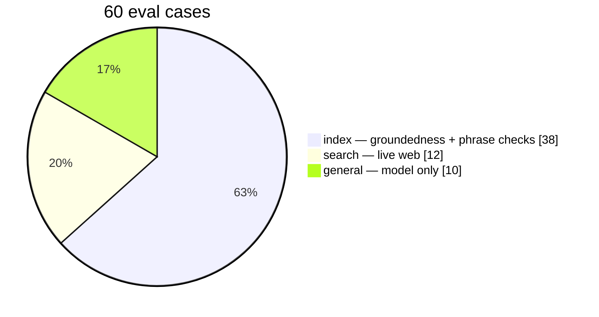
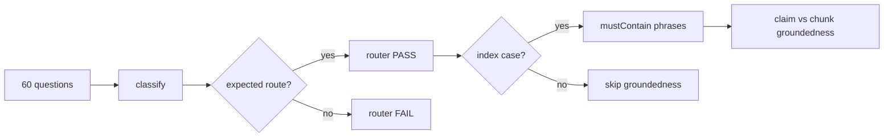

# Adaptive RAG

Next.js app that routes each question through a LangGraph.js graph: indexed documents, live web search, or the model alone. Weak document hits get one rewrite, then web search. The UI shows the path, sources, and time per hop.

## Graph



Rewrite budget is one. That stops an infinite retrieve loop.

Retrieve is hybrid: Qdrant vector search plus keyword search, fused with reciprocal rank fusion. If the question names a `.txt` file, those chunks are used first.

## Metrics

Latest local run ([eval/RESULTS.md](eval/RESULTS.md), 2026-09-07):

| Metric | Score |
| --- | --- |
| Router accuracy | **60/60** |
| Phrase checks (index facts) | **38/38** |
| Groundedness (claims in chunks) | **87/97** |

`npm run eval` refreshes those files.





| What | How it is measured |
| --- | --- |
| Router accuracy | Actual `route` vs `expectedRoute` |
| Phrase checks | Index answers must include listed facts from the sample files |
| Groundedness | Each index claim is checked against retrieved chunks |
| Hop time | Milliseconds per graph node, shown under each chat answer |
| Sources | Filenames / URLs cited on the answer |

## Knowledge base

These files are seeded into Qdrant on first use (and any missing sample is added later):

| File | Facts |
| --- | --- |
| [data/sample/azure-ai.txt](data/sample/azure-ai.txt) | Adaptive RAG, Azure AI Search, Document Intelligence, Content Safety |
| [data/sample/langgraph-orchestrator.txt](data/sample/langgraph-orchestrator.txt) | LangGraph.js, `classify` vs `route` |
| [data/sample/qdrant-store.txt](data/sample/qdrant-store.txt) | Collection, hybrid retrieve, RRF |
| [data/sample/mongodb-sessions.txt](data/sample/mongodb-sessions.txt) | Sessions, `localStorage` key, 16-turn window |
| [data/sample/tavily-search.txt](data/sample/tavily-search.txt) | Tavily, 4 results, `keptDocs` |
| [data/sample/eval-and-grade.txt](data/sample/eval-and-grade.txt) | Grade is read-only, rewrite budget is one |
| [data/sample/models-and-chunking.txt](data/sample/models-and-chunking.txt) | `gpt-4o-mini`, 1000 / 150 chunks |
| [data/sample/product-scope.txt](data/sample/product-scope.txt) | No login, three routes, APIs, CI |

## Setup

1. Copy `.env.example` to `.env.local`. Set `OPENAI_API_KEY`, or the Azure OpenAI variables. Set `TAVILY_API_KEY` for web search.
2. Start MongoDB and Qdrant:

```bash
docker compose up -d
```

3. Install and run:

```bash
npm install
npm run dev
```

Open [http://localhost:3000](http://localhost:3000). Sample files under `data/sample/` are indexed automatically.

Try:

- Index: `What rewrite budget does the Adaptive RAG demo use?`
- Search: `Who won the most recent UEFA Champions League final?`
- General: `What is 2 + 2?`

## Eval

```bash
npm run eval
```

That command:

1. Checks all **60** cases in [eval/cases.json](eval/cases.json)
2. Scores groundedness on the **38** index cases
3. Checks `mustContain` phrases on those index answers
4. Writes [eval/RESULTS.md](eval/RESULTS.md) and [eval/latest.json](eval/latest.json)

Details: [docs/EVALUATION.md](docs/EVALUATION.md).

## Screenshots (optional)

GitHub already renders the Mermaid diagrams above. Screenshots are optional. If you add any, put them in `docs/images/` and link them here:

1. Chat answer with path chips, sources, and hop timing  
2. Sidebar showing indexed files  
3. Terminal output of `npm run eval` (or just commit the generated `eval/RESULTS.md`)

You do not need a hosted demo screenshot.

## Commands

```bash
docker compose up -d
npm run dev
npm run eval
npx tsc --noEmit
npm run lint
```

CI runs `tsc` and lint on push and pull requests. Eval stays local because it needs model keys.

## Docs

| File | Contents |
| --- | --- |
| [prd.md](prd.md) | Product requirements |
| [tech-stack.md](tech-stack.md) | Libraries and env |
| [decision.md](decision.md) | Why each stack and graph choice was made |
| [docs/ARCHITECTURE.md](docs/ARCHITECTURE.md) | Graph, APIs, persistence |
| [docs/REQUIREMENTS.md](docs/REQUIREMENTS.md) | FR / NFR IDs |
| [docs/EVALUATION.md](docs/EVALUATION.md) | How eval works |
| [eval/RESULTS.md](eval/RESULTS.md) | Latest scores |
| [AGENTS.md](AGENTS.md) | Short project notes |
