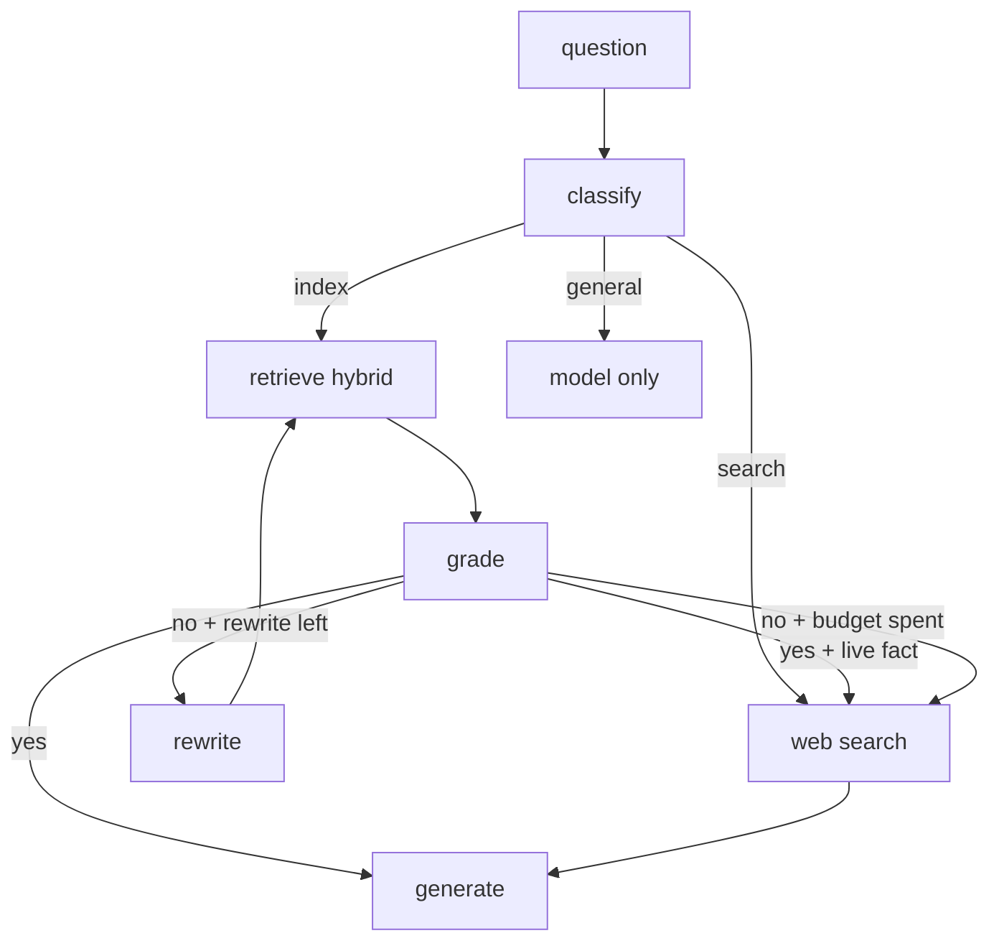

# Adaptive RAG

Next.js app that routes each question through a LangGraph.js graph: indexed documents, live web search, or the model alone. Weak document hits get one rewrite, then web search. The UI shows the path, sources, and time per hop.

Based on the Adaptive RAG idea from [dhruvsinghal09/Adaptive-Rag](https://github.com/dhruvsinghal09/Adaptive-Rag). Spec: [prd.md](prd.md).

## Graph



Rewrite budget is one. That stops an infinite retrieve loop.

Retrieve is hybrid: Qdrant vector search plus keyword search, fused with reciprocal rank fusion. If the question names a `.txt` file, those chunks are used first.

## Setup

1. Copy `.env.example` to `.env.local`. Set `OPENAI_API_KEY`, or the Azure OpenAI variables. Set `TAVILY_API_KEY` for web search.
2. Start MongoDB and Qdrant:

```bash
docker compose up -d
```

3. Install and run:

```bash
npm install
npm run dev
```

Open [http://localhost:3000](http://localhost:3000). `data/sample/azure-ai.txt` is indexed on the first question.

Try:

- Index: `What rewrite budget does the Adaptive RAG demo use?`
- Search: `Who won the most recent UEFA Champions League final?`
- General: `What is 2 + 2?`

## Eval

```bash
npm run eval
```

The runner checks:

- Router accuracy: expected `index` / `search` / `general` vs actual
- Groundedness on index answers: each claim is checked against retrieved chunks

Details: [docs/EVALUATION.md](docs/EVALUATION.md).

## Commands

```bash
docker compose up -d
npm run dev
npm run eval
npx tsc --noEmit
npm run lint
```

CI runs `tsc` and lint on push and pull requests.

## Docs

| File | Contents |
| --- | --- |
| [prd.md](prd.md) | Product requirements |
| [tech-stack.md](tech-stack.md) | Libraries and env |
| [decision.md](decision.md) | Why each stack and graph choice was made |
| [docs/ARCHITECTURE.md](docs/ARCHITECTURE.md) | Graph, APIs, persistence |
| [docs/REQUIREMENTS.md](docs/REQUIREMENTS.md) | FR / NFR IDs |
| [docs/EVALUATION.md](docs/EVALUATION.md) | How eval works |
| [AGENTS.md](AGENTS.md) | Short project notes |
