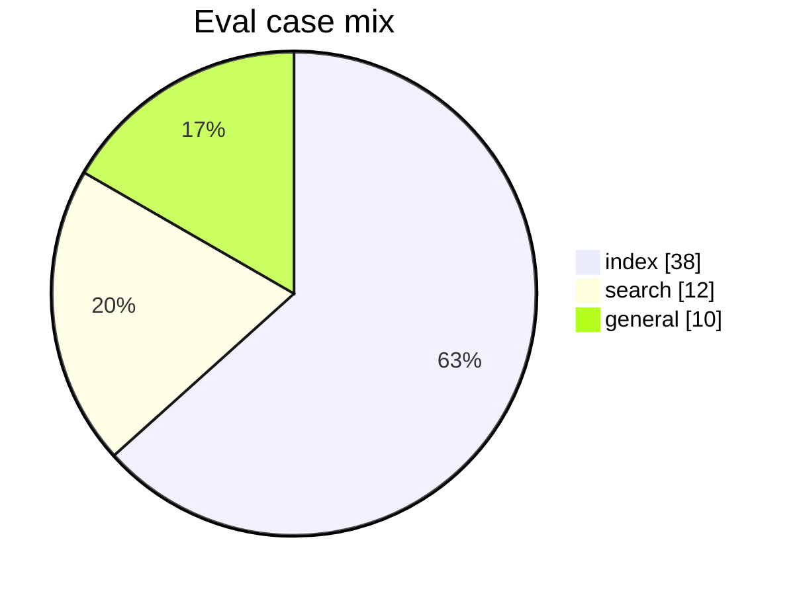

# Eval results

Generated: 2026-09-07T17:11:35.008Z

## Scores

| Metric | Value |
| --- | --- |
| Cases | 60 |
| Router accuracy | 60/60 |
| Phrase checks (index mustContain) | 38/38 |
| Groundedness (supported claims) | 87/97 |

## Case mix

| Route | Count |
| --- | --- |
| index | 38 |
| search | 12 |
| general | 10 |

## Failures

_None._

Run `npm run eval` to refresh this file.
